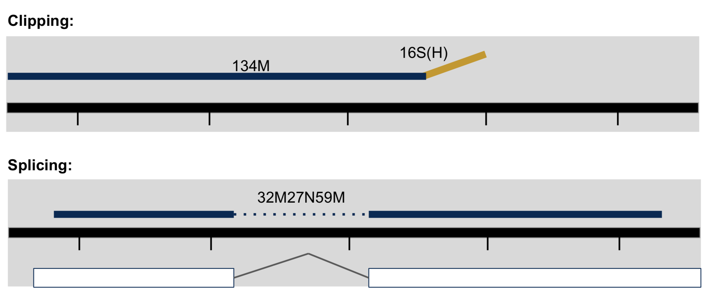

# Alignment to Read Counts & Visualization in IGV

1. Initial Setup
1. Mapping vs Assembly
2. Aligners/Mappers
5. Alignments
6. Running Bowtie2 on the experiment
7. Quality Assurance - Mapping statistics as QA/QC.

---
## Initial Setup

*This document assumes [preproc htstream](./preproc_htstream.md) has been completed.*

*This document assumes [reference indexing](./02-alignment-indexref_mm.md) has been completed.*

---
## Mapping vs Assembly

**Assembly** seeks to put together the puzzle without knowing what the picture is.

- The focus is on the pieces, how they fit together.

**Mapping** (or alignment to a reference) tries to put together the puzzle pieces directly onto an image of the picture.

- The focus is on the puzzle, regions of the puzzle that contain certain characteristics (ex. what background) that will help you place the piece onto the puzzle.
- In mapping the question is more, given a small chunk of sequence, where in the genome did this sequence most likely come from.
- The goal then is to find the match(es) with either the “best” edit distance (smallest difference), or all matches with edit distance less than max edit distance. Main issues are:

  * Large search space
* Regions of similarity (aka repeats)
* Gaps (INDELS)
* Complexity (RNA, splicing, transcripts)

### Alignment concepts

* Multimappers:
  * Reads that align equally well to more than one reference location.
  * Generally, multimappers are discounted in variant detection, and are often discounted in counting applications (like RNA-Seq ... would “cancel” out anyway).
  * Note: multimapper “rescue” in some algorithms (RSEM, Express?).
* Duplicates:
  * Reads or read pairs arising from the same original library fragment, either during library preparation (PCR duplicates).
  * Generally, duplicates can only be detected reliably with paired-end sequencing. If PE, they’re discounted in variant detection, and discounted in counting applications (like RNA-Seq).
* Clipping vs Splicing
  * soft-clipped: bases in 5' and 3' of the read are NOT part of the alignment.
  * hard-clipped: bases in 5' and 3' of the read are NOT part of the alignment AND those bases have been
  removed from the read sequence in the BAM file. The 'real' sequence length would be length(SEQ)+ count-of-hard-clipped-bases
  * [From biostars](https://www.biostars.org/p/119537/)



* Inner length, insert size, fragment length


*From [This Biostars answer](https://www.biostars.org/p/106291/)*


#### Considerations when mapping
* Placing reads in regions that do not exist in the reference genome (reads extend off the end of linearized fragments) [ mitochondrial, plasmids, structural variants, etc.].
* Sequencing errors and genetic variation: alignment between read and true source in genome may have more differences than alignment with some other copy of repeat.
* What if the closest fully sequenced genome is too divergent?
* Placing reads in repetitive regions: Some algorithms only return 1 mapping; If multiple: map quality = 0
* Algorithms that use paired-end information => might prefer correct distance over correct alignment.

---
## Aligners/Mappers
Many [alignment algorithms](https://en.wikipedia.org/wiki/List_of_sequence_alignment_software
) to choose from. Examples include:
* Spliced Aligners
  * STAR
  * HiSAT2 (formerly Tophat [Bowtie2])
  * GMAP/GSNAP
  * SOAPsplice
  * MapSplice
* Aligners that can ’clip’
  * bwa-mem
  * minimap
  * Bowtie2 both global and local mode

#### Pseudo-aligners (salmon and kalisto) for counting applications
* Quasi-mapping
* Probabilistic
* Map to transcripts, not genome
* Does transcript quantifications (or gene)
* Blazing FAST and can run on most laptops
* Experience suggests differences between “traditional” mappers are in the low abundance genes.

---
### Genome and Genome Annotation

Genome sequence fasta files and annotation (gff, gtf) files go together! These should be identified at the beginning of analysis.

* Genome fasta files should include all primary chromosomes, unplaced sequences and un-localized sequences, as well as any organelles. Should bet contain any contigs that represent patches, or alternative haplotypes.
* If you expect contamination, or the presence of additional sequence/genome, add the sequence(s) to the genome fasta file.
* Annotation file should be GTF (preferred), and should be the most comprehensive you can find.
  * Chromosome names in the GTF must match those in the fasta file (they don’t always do).

---
## Alignments

1. We are now ready to try an alignment:

    ```bash
    cd /share/workshop/alliance_covid/msettles/covid_swift/HTS_testing
    ```

    and let's run Bowtie2 on the pair of streamed test files we created earlier:

1. Then run the Bowtie2 commands

    ```bash
    module load bowtie2
    module load samtools
    bowtie2 --threads 4 \
            --very-sensitive \
            -x ../resources/NC_045512.2.fasta \
            -U  GSR-SWIFT-2021-04-08-FS25275372.preprocessed_SE.fastq.gz | \
            samtools sort --threads 4 -o GSR-SWIFT-2021-04-08-FS25275372-se.bam -
    ```

    In the command, we are telling Bowtie2 to map the reads to the genome in --very-sensitive mode. Then piping to samtools sort to produce the sorted bam file.

###  Now let's take a look at an alignment in IGV.

1.  We first need to index the bam file, will use 'samtools' for this step, which is a program to manipulate SAM/BAM files. Take a look at the options for samtools and 'samtools index'.

    ```bash
    module load samtools
    samtools
    samtools index
    ```

    We need to index the BAM file:

    ```bash
    cd /share/workshop/alliance_covid/msettles/covid_swift/HTS_testing

    samtools index -@ 4 GSR-SWIFT-2021-04-08-FS25275372-se.bam
    ```


2. Transfer GSR-SWIFT-2021-04-08-FS25275372-se.bam and GSR-SWIFT-2021-04-08-FS25275372-se.bam.bai (the index file) to your computer using scp or winSCP.

    In Mac/Linux, Windows users use WinSCP. In a new shell session on my laptop. **NOT logged into tadpole**. Replace [your_username] with your username
    ```bash
    mkdir ~/covid_workshop
    cd ~/covid_workshop
    scp [your_username]@tadpole.genomecenter.ucdavis.edu:/share/workshop/alliance_covid/[your_username]/covid_swift/HTS_testing/GSR-SWIFT-2021-04-08-FS25275372-se.bam* .
    ```

    Its ok of the mkdir command fails ("File exists") if its aleady been created.

1. Now we are ready to use IGV.

    Go to the [IGV page at the Broad Institute](http://software.broadinstitute.org/software/igv/).

    

    And then navigate to the download page, [IGV download](http://software.broadinstitute.org/software/igv/download)

    

    Here you can download IGV for your respective platform (Window, Mac OSX, Linux), but we are going to use the web application they supply, [IGV web app](https://igv.org/app).

    

1. The first thing we want to do is load the Covid genome. Click on "Genomes" in the menu and choose "Sars-CoV-2 (ASM985889v3)".

    

    

1. Now let's load the alignment bam and index files. Click on "Tracks" and choose "Local File ...".

    

    Navigate to where you transferred the bam and index file and select them **both**.

    

    Now your alignment is loaded. Any loaded bam file aligned to a genome is called a "track".

    

1. Play with IGV, zoom in/out, color reads, etc. Get to know the alignments.

**EXCERSICE**

Now do the same thing for the pairs, and load that as a second track in IGV.
  * Does it fill in any "holes"?

---
## Running Bowtie2 on the experiment

- work through Running Bowtie2 on all samples
- work through QA/QC of the experiment
- complete the questions at the end

1. We can now run Bowtie2 across all samples on the real data using a SLURM script, [map_bowtier2.slurm](../software_scripts/scripts/map_bowtie2.slurm), that we should take a look at now.

    ```bash
    cd /share/workshop/alliance_covid/msettles/covid_swift  # We'll run this from the main directory
    wget https://raw.githubusercontent.com/ucdavis-bioinformatics-training/2021-Alliance-Makerere_Covid/master/software_scripts/scripts/map_bowtie2.slurm
    less map_bowtie2.slurm
    ```

    <pre class="prettyprint"><code class="bash" style="background-color:333333">#!/bin/bash
    #
    #SBATCH --job-name=map_bwa # Job name
    #SBATCH --nodes=1
    #SBATCH --ntasks=20 # Number of cores
    #SBATCH --mem=16000 # Memory pool for all cores (see also --mem-per-cpu)
    #SBATCH --time=1-00
    #SBATCH --array=1
    #SBATCH --partition=production # Partition to submit to
    #SBATCH --account=workshop # cluster account to use for the job
    #SBATCH --reservation=workshop # cluster account reservation
    #SBATCH --output=slurmout/map_bowtie-%A_%a.out # File to which STDOUT will be written
    #SBATCH --error=slurmout/map_bowtie-%A_%a.err # File to which STDERR will be written
    #SBATCH --mail-type=ALL # Type of email notification- BEGIN,END,FAIL,ALL
    #SBATCH --mail-user=youremail@whatever.com # Email to which notifications will be sent

    start=`date +%s`
    echo $HOSTNAME
    echo "My SLURM_ARRAY_TASK_ID: " $SLURM_ARRAY_TASK_ID

    inpath=01-HTS_Preproc_Amplicon

    sample=`sed "${SLURM_ARRAY_TASK_ID}q;d" $1`

    r1=${inpath}/${sample}_R1.fastq.gz
    r2=${inpath}/${sample}_R2.fastq.gz
    se=${inpath}/${sample}_SE.fastq.gz

    outpath='02-Bowtie2'
    dname=`dirname "$sample"`
    [[ -d ${outpath}/${dname} ]] || mkdir -p ${outpath}/${dname}

    echo "SAMPLE: ${sample}"

    THREADS=${SLURM_NTASKS}
    #THREADS=20
    MEM=$(expr ${SLURM_MEM_PER_NODE} / 1024)
    #MEM=16
    MAPTHREADS=$(expr ${THREADS} - 6)
    SORTTHREADS=$(expr ${THREADS} - ${MAPTHREADS})


    module load bowtie2
    module load samtools

    output=${outpath}/${sample}
    mapfasta=./resources/NC_045512.2.fasta


    ## PE ##
    call="bowtie2 --threads ${MAPTHREADS} \
     --very-sensitive \
     -x ${mapfasta} -1 ${r1} -2 ${r2} \
     | samtools sort -m 768M --threads ${SORTTHREADS} -o ${output}-pe.bam -"
    echo $call
    eval $call

    ## SE ##
    call="bowtie2 --threads ${MAPTHREADS} \
     --very-sensitive \
     -x ${mapfasta} -U ${se} \
     | samtools sort -m 768M --threads ${SORTTHREADS} -o ${output}-se.bam -"
    echo $call
    eval $call

    call="samtools merge -@ ${THREADS} ${output}.bam  ${output}-pe.bam ${output}-se.bam"
    echo $call
    eval $call

    call="samtools index -@ ${THREADS} ${output}.bam"
    echo $call
    eval $call

    call="samtools idxstats ${output}.bam > ${output}.idxstats"
    echo $call
    eval $call

    call="samtools flagstat -@ ${THREADS} ${output}.bam > ${output}.flagstat"
    echo $call
    eval $call

    call="samtools stats -@ ${THREADS} ${output}.bam > ${output}.stats"
    echo $call
    eval $call

    end=`date +%s`

    runtime=$((end-start))

    echo $runtime
    </code></pre>


When you are done, type "q" to exit.

2. After looking at the script, lets run it.

    ```bash
    sbatch map_bowtie2.slurm swift_samples.B5.txt # moment of truth!
    ```

    We can watch the progress of our task array using the 'squeue' command. Takes about 2 minutes to process each sample.

    ```sbatch
    squeue -u msettles  # use your username
    ```

3. If you want to be challenged run multiqc on the results for both htstream and bowtie2.
